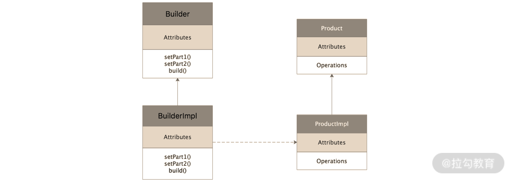

构造者模式类图：

Product：接口，定义了product类型对象的一些列行为。

productImpl：product接口实现类，实现了具体行为。

builder：构造器接口，定义了product对象的每一步行为。

builderImpl：builder的具体实现接口，通过每一步构造好product对象之后，通过build方法返回构建好的product对象。

什么时候需要用到构造者模式：
（1）目标对象的属性之多（复杂）难以创建，这个时候使用方提供配置文件，builder负责读取配置文件，然后构造出目标对象，从而实现解耦的结果。
（2）通常情况下一些复杂对象有很多默认的属性，将这些默认属性封装在builder中。
